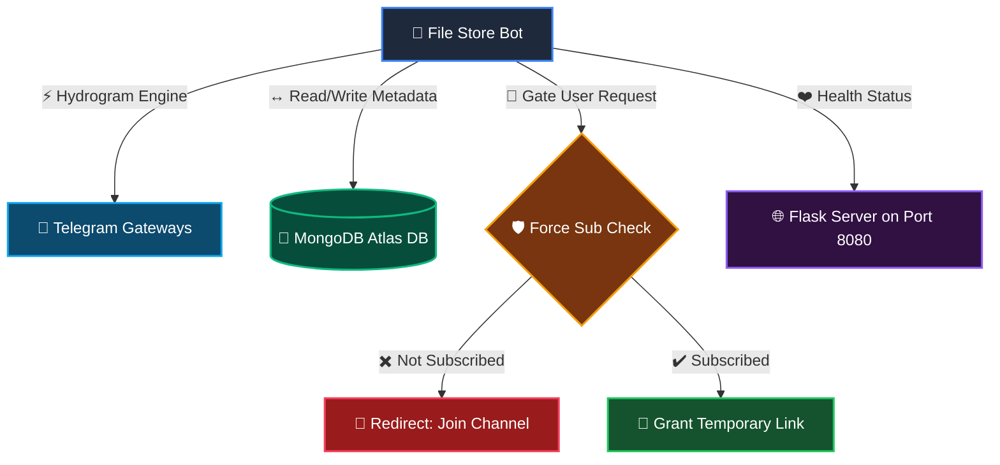
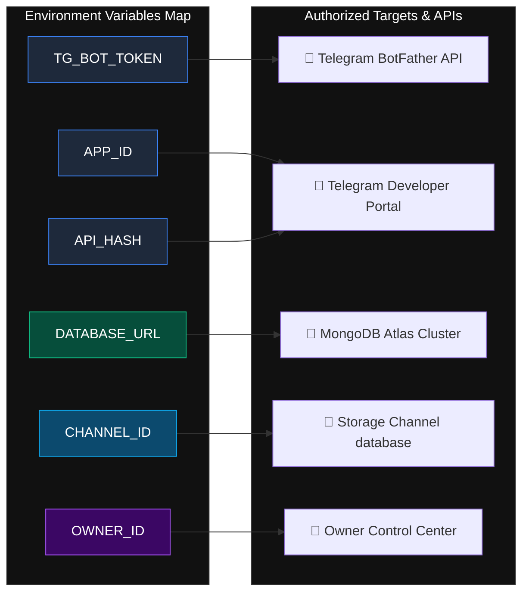

<p align="center">
  <a href="#!">
    
  </a>
</p>

<h1 align="center">🤖 Telegram File Store Bot</h1>

<p align="center">
  <b>A hyper-fast, secure, and modern Telegram File Storage engine built on Hydrogram (API Layer 223). Bypasses ads, handles dynamic auto-deletion, and forces community subscriptions automatically.</b>
</p>

<p align="center">
  <a href="#!"></a>
  <a href="#!"></a>
  <a href="#!"></a>
  <a href="#!"></a>
</p>

<hr style="border: 0; height: 1px; background: linear-gradient(to right, rgba(255,255,255,0), rgba(255,255,255,0.15), rgba(255,255,255,0)); margin: 30px 0;" />

## 📡 Live System Diagnostics & Flowchart

<p align="center">
  <a href="#!"></a>
  <a href="#!"></a>
</p>



<hr style="border: 0; height: 1px; background: linear-gradient(to right, rgba(255,255,255,0), rgba(255,255,255,0.15), rgba(255,255,255,0)); margin: 30px 0;" />

## ⚡ Core Features

*   **🎨 Custom Button Background Colors**
    Seamlessly style buttons with background colors (Primary, Danger, Success) using `style="primary"`, `style="danger"`, or `style="success"` keyword arguments natively, achieved by global monkey-patches on `InlineKeyboardButton.__init__` and `InlineKeyboardButton.write`.
*   **📂 Dynamic File Indexing**
    Securely upload, store, and automatically index files sent to designated private database channels.
*   **🔗 Instant Link Engine**
    Generates secure, direct, and custom-formatted batch or single links in milliseconds.
*   **⏳ Automatic File Purge**
    Customizable auto-delete timers secure shared materials from being leaked permanently.
*   **🛡️ Force Join Controller**
    Gates file links until users actively subscribe to configured target update channels.
*   **🌐 Built-in KeepAlive Web Server**
    Integrated Flask micro-service ensures cloud deployments survive health checks without entering sleep mode.
*   **🐳 Multi-Platform Deployment**
    Optimized to run on Docker, Heroku Procfiles, Koyeb, VPS systems, and Render with ease.

<hr style="border: 0; height: 1px; background: linear-gradient(to right, rgba(255,255,255,0), rgba(255,255,255,0.15), rgba(255,255,255,0)); margin: 30px 0;" />

## 🛠 Commands Deck

<details>
<summary><b>👤 Click to Expand User Commands</b></summary>
<br>

*   `/start` — Initialize the bot interface and check system availability.
*   `/help` — Display detailed commands list and usage tutorial.
*   `/ping` — View Bot Database Connection Speed.

</details>

<details>
<summary><b>👑 Click to Expand Admin Commands</b></summary>
<br>

### 📡 Broadcast & Performance
*   `/commands` — View a comprehensive quick list of administrative commands.
*   `/stats` — Monitor server metrics like CPU/RAM usages and user volume.
*   `/users` — Get precise counts of active registered users in the database.
*   `/broadcast` — Broadcast a targeted global text message to all users.
*   `/retrieve_on ` — Toggle on Auto-Delete Msg Alert.
*   `/retrieve_off` — Toggle off Auto-Delete Msg Alert
*   `/pbroadcast` — Broadcast photos with customized HTML captions.
*   `/dbroadcast` — Broadcast direct videos, audios, or generic files.

### 🔗 Link & Parameter Settings
*   `/genlink` — Generate a secure unique shareable link for a single file.
*   `/batch` — Bundle several file components into one single access key.
*   `/custom_batch` — Generate highly customized multi-file access routes.
*   `/dlt_time` — Set global delay timers before shared files are purged.
*   `/check_dlt_time` — Read current file auto-delete timer configuration.

### 🛡️ Access & Moderation Tools
*   `/ban` — Revoke a specific user ID's access to the bot engine.
*   `/unban` — Re-authorize blocked users in the system database.
*   `/banlist` — Inspect all restricted users currently locked out of service.
*   `/addchnl` — Add a channel to the mandatory subscriber verification checks.
*   `/delchnl` — Remove a channel from force-subscription verification.
*   `/listchnl` — List all channels currently enforcing active membership checks.
*   `/fsub_mode` — Globally toggle the force-subscription requirement on or off.

### 🔑 Security Privileges
*   `/add_admin` — Promote a user to authorized administrator status.
*   `/deladmin` — Revoke administrative rights from a specific user.
*   `/admins` — Fetch the directory of registered system administrators.

</details>

<hr style="border: 0; height: 1px; background: linear-gradient(to right, rgba(255,255,255,0), rgba(255,255,255,0.15), rgba(255,255,255,0)); margin: 30px 0;" />

## ⚙️ Configuration Variables Blueprint

Below is the structured table representation of required configuration keys to link your services successfully:

| Variable | Type | Description | Required | Reference / Source |
| :--- | :--- | :--- | :--- | :--- |
| `APP_ID` | Integer | API identifier obtained from the portal. | **Yes** | [Telegram Developer Portal](https://my.telegram.org) |
| `API_HASH` | String | API Hash key companion matching the `API_ID`. | **Yes** | [Telegram Developer Portal](https://my.telegram.org) |
| `TG_BOT_TOKEN` | String | Bot token generated by BotFather. | **Yes** | [@BotFather](https://t.me/BotFather) |
| `DATABASE_URL` | Connection String | Your MongoDB Atlas or local deployment database URL. | **Yes** | [MongoDB Atlas Cluster](https://www.mongodb.com/cloud/atlas) |
| `CHANNEL_ID` | Integer | Destination database channel ID where files are stored. | **Yes** | Telegram Storage Channel |
| `OWNER_ID` | Integer | Your personal Telegram User ID to bypass authorization. | **Yes** | Owner Control Center |



<hr style="border: 0; height: 1px; background: linear-gradient(to right, rgba(255,255,255,0), rgba(255,255,255,0.15), rgba(255,255,255,0)); margin: 30px 0;" />

## 🚀 Easy Deployment

### 1. Cloud Deploy Support
Deploy directly using cloud services (Badges are active to open their respective setup pages, they do not trigger white raw image views):

<p align="left">
  <a href="https://dashboard.koyeb.com/deploy" target="_blank">
    
  </a>
  <a href="https://render.com/deploy" target="_blank">
    
  </a>
  <a href="https://heroku.com/deploy" target="_blank">
    
  </a>
</p>

### 2. VPS Setup (Ubuntu/Debian)

```bash
# Clone the repository
git clone https://github.com/Unrated-Coder/Telegram-File-Store.git
cd telegram-file-store

# Install required dependencies
pip3 install -r requirements.txt

# Run the engine
python3 main.py
```

<hr style="border: 0; height: 1px; background: linear-gradient(to right, rgba(255,255,255,0), rgba(255,255,255,0.15), rgba(255,255,255,0)); margin: 30px 0;" />

## ⭐️ Credits & Developer
Modified, optimized, and maintained with ❤️ by **[@EmptyJohan](https://t.me/UnknownBotz)**. 

Join our official channel for instant support, updates, and more elite open-source projects:

<p align="left">
  <a href="https://t.me/UnknownBotz">
    
  </a>
</p>
